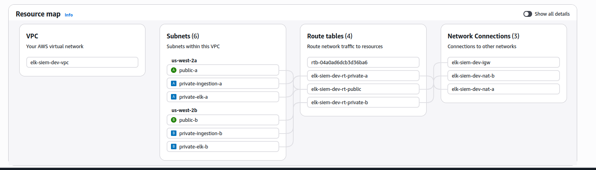
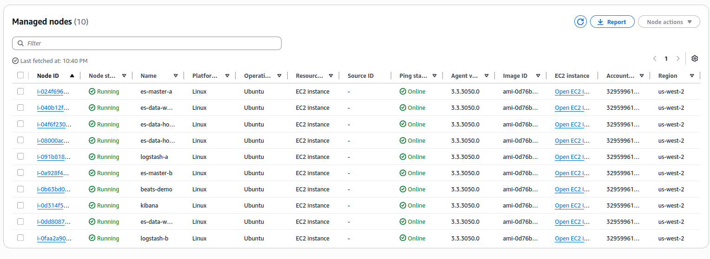
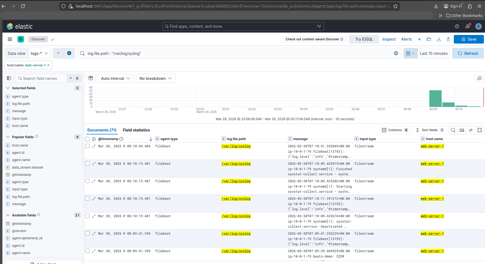

# AWS SIEM Lab (Elastic Stack on EC2, Terraform)

This repo builds a small SIEM-style lab in AWS using Elasticsearch + Logstash + Kibana (ELK) on EC2, wired together with private subnets, SSM access, KMS encryption, and S3 snapshots. It’s designed to be reproducible, teardown-friendly, and good for portfolio screenshots.



## What’s in here

- `bootstrap/`: Creates the remote Terraform backend (S3 state bucket + DynamoDB lock table + KMS key).
- `elk-siem/`: Main infrastructure (VPC, EC2 for ES/Logstash/Kibana, internal Beats NLB, Secrets Manager, snapshot bucket, flow logs, alarms).
- `SIEM_ARCHITECTURE_PLAN.md`: High-level design notes.
- `IAC_SUMMARY.md`: Implementation summary / knobs.

## Architecture (at a glance)

Data flow:

`Filebeat (demo host)` → `internal NLB :5044 (TCP)` → `Logstash` → `Elasticsearch (HTTPS :9200)` → `Kibana (HTTPS :5601)`

Notes:
- Elasticsearch uses TLS on both transport (`:9300`) and HTTP (`:9200`).
- Kibana is intended to be private-only by default (SSM port-forward), with an optional public ALB/WAF path if you enable it and provide an ACM cert.
- The Beats-to-Logstash hop is **plain TCP** in the current lab config (inside the VPC). If you want TLS there, see “Hardening” below.

## Screenshots (examples)

Managed nodes / SSM visibility:



Example logs in Kibana:



## Prereqs

- Terraform installed locally
- AWS credentials configured (e.g. `aws configure` or SSO)
- Session Manager plugin (for port-forwarding via SSM)

## Deploy

1) Bootstrap the remote backend

```bash
cd bootstrap
terraform init
terraform apply
terraform output
```

2) Deploy the main stack

```bash
cd ../elk-siem
terraform init -reconfigure
terraform apply
```

Configuration lives in `elk-siem/terraform.tfvars`. In `dev`, this repo supports faster teardown (force-destroy buckets, short recovery windows, etc.). Don’t reuse those settings for prod.

## Access Kibana (no domain / no ACM)

Port-forward to the Kibana instance over SSM (replace the instance id):

```bash
aws ssm start-session \
  --target i-xxxxxxxxxxxxxxxxx \
  --document-name AWS-StartPortForwardingSession \
  --parameters portNumber=5601,localPortNumber=5601
```

Then open:

- `https://localhost:5601`

## Generate demo logs

On the demo host (SSM shell):

```bash
for i in $(seq 1 50); do
  logger -t beats-demo "SIEM screenshot event $i $(date -Is)"
  sleep 1
done
```

In Kibana:

- Discover → data view `logs-*` (or whatever indices/data streams you see)
- KQL: `message:"SIEM screenshot event"`

## Destroy (important for cost)

Destroy the main stack first, then the backend:

```bash
cd elk-siem
terraform destroy

cd ../bootstrap
terraform destroy
```

Some resources (notably KMS keys) can remain in “pending deletion” for a while by design.

## Hardening notes (optional)

If you plan to expand this beyond a lab:

- Enable TLS on the Beats → Logstash hop (NLB stays TCP pass-through; Logstash terminates TLS).
- Consider replacing self-signed certs with ACM/Private CA where appropriate.
- Lock down security groups to only required sources (VPN, VPC CIDRs, specific workload subnets).

