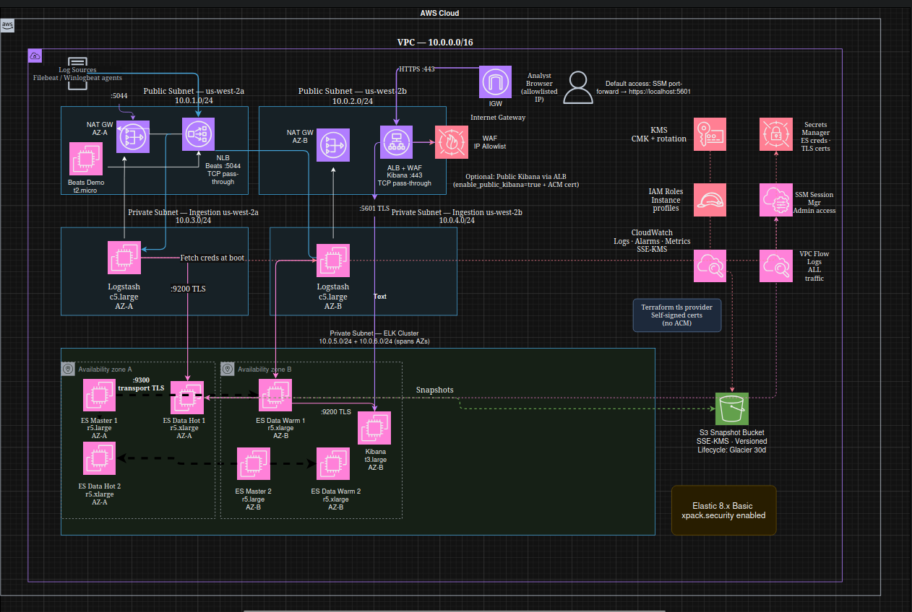

# AWS SIEM Lab (Elastic Stack on EC2, Terraform)

This repo is a hands-on SIEM lab build in AWS: Elasticsearch + Logstash + Kibana on EC2, segmented into public/ingestion/cluster subnets, with Secrets Manager, KMS encryption, VPC flow logs, and S3 snapshots. The goal is a realistic security engineering exercise you can stand up, validate with real events, take screenshots, and tear down quickly.



## What this build optimizes for

- **Private-first access**: Kibana is reachable via SSM port-forward by default; no public ingress required.
- **Defense-in-depth basics**: KMS for at-rest encryption (EBS/S3/Secrets), restricted security groups, and VPC flow logs.
- **Operational simplicity**: Everything bootstraps from user-data, pulls secrets at boot, and avoids manual “click ops” where possible.
- **Cost control**: Dev-friendly destroy behavior (force-destroy buckets, short secret recovery windows) so the lab doesn’t linger.

## Data path (how logs move)

`Filebeat (demo host)` → `internal NLB :5044 (TCP)` → `Logstash` → `Elasticsearch (HTTPS :9200)` → `Kibana (HTTPS :5601)`

Kibana is not in the ingest path; it reads from Elasticsearch.

## Key engineering decisions (and why)

- **No ACM + no public Kibana by default**
  - This lab was built without a domain on hand, so an ACM-backed HTTPS listener on a public ALB wasn’t the fastest path to “working screenshots”.
  - Default access is **SSM port-forward → `https://localhost:5601`**.
  - If you *do* want a public entry point later, the IaC supports “bring your own cert” via ACM: set `enable_public_kibana=true` and provide `acm_cert_arn`.

- **TLS where it matters most**
  - Elasticsearch runs TLS for HTTP (`:9200`) and transport (`:9300`).
  - The Beats hop is **plain TCP inside the VPC** in the current config. We originally tried Beats TLS, but the cert/key bootstrapping wasn’t reliable and Logstash crash-looped. For a lab, reliability > perfection.

- **Secrets are pulled at boot**
  - Instances use IAM instance profiles + SSM, and fetch Secrets Manager values during user-data.
  - This keeps sensitive values out of the repo and avoids baking credentials into AMIs.

- **Backups are real (and cheap over time)**
  - Elasticsearch snapshots go to a dedicated S3 bucket with SSE-KMS + versioning.
  - Lifecycle defaults: **Glacier after 30 days**, delete after **365 days**.

## Repo layout

- `bootstrap/`: Remote Terraform backend (S3 state bucket + DynamoDB lock table + KMS key).
- `elk-siem/`: Main stack (VPC, EC2, internal Beats NLB, Secrets Manager, snapshot bucket, flow logs, alarms).
- `SIEM_ARCHITECTURE_PLAN.md`: Design notes.
- `IAC_SUMMARY.md`: What was built / key knobs.

## Screenshots (examples)


## Minimal “how to run it”

You’ll configure values in `elk-siem/terraform.tfvars`, then:

```bash
cd bootstrap && terraform init && terraform apply
cd ../elk-siem && terraform init -reconfigure && terraform apply
```

## Tear down

```bash
cd elk-siem && terraform destroy
cd ../bootstrap && terraform destroy
```

Expect some resources (notably KMS keys) to sit in “pending deletion” for a while by design.
