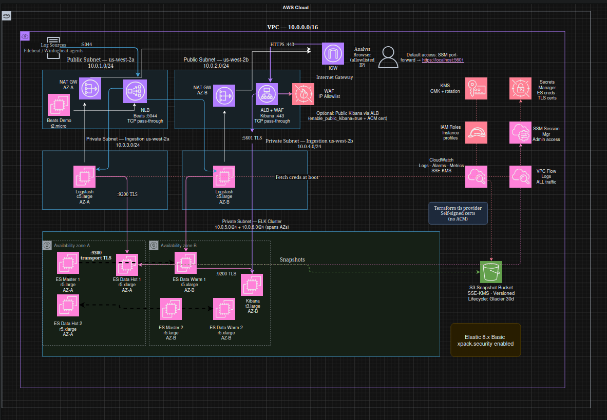

# AWS SIEM Lab (Elastic Stack on EC2, Terraform)

This repository builds a small SIEM lab in AWS using Elasticsearch, Logstash, and Kibana on EC2. The stack is provisioned with Terraform and includes subnet separation, Secrets Manager integration, KMS-backed encryption, VPC flow logs, and S3 snapshot storage.

The project was built as a practical security engineering exercise rather than a production-ready platform. The focus here is standing up the environment, moving log data end to end, validating the pipeline with real events, and keeping the whole thing easy to destroy when the lab is done.



## Design goals

- **Private access by default**: Kibana is intended to be reached over SSM port forwarding, so there is no requirement for public ingress.
- **Reasonable security baseline**: EBS, S3, and Secrets Manager are encrypted with KMS, security groups are narrow, and VPC flow logs are enabled.
- **Minimal manual setup**: Instances bootstrap from user data and pull required secrets at launch.
- **Easy cleanup**: The lab is meant to be created, tested, documented, and torn down without much leftover infrastructure.

## Data flow

`Filebeat (demo host)` → `internal NLB :5044 (TCP)` → `Logstash` → `Elasticsearch (HTTPS :9200)` → `Kibana (HTTPS :5601)`

Kibana is not in the ingest path; it reads from Elasticsearch.

## Engineering choices

- **Kibana stays private unless you explicitly expose it**
  - Default operator access is `SSM port-forward -> https://localhost:5601`.
  - Public Kibana is supported, but only if DNS and ACM are already in place. To enable it, set `enable_public_kibana=true` and provide `acm_cert_arn`.

- **TLS is enabled on the Elasticsearch side**
  - Elasticsearch uses TLS for both HTTP (`:9200`) and node transport (`:9300`).
  - In this lab build, Beats to Logstash traffic is plain TCP inside the VPC.

- **Beats on `5044` was kept simple on purpose**
  - During bootstrap testing, Logstash failed repeatedly because the Beats input expected a cert/key pair that was not present on disk when the service started.
  - For this version of the lab, reliability mattered more than full transport hardening, so `:5044` was left as TCP inside the VPC with the NLB operating as a pass-through listener.
  - For anything beyond a lab build, Beats or Elastic Agent to Logstash should use TLS, ideally mTLS.

- **Secrets are retrieved at boot**
  - Instances use IAM roles and SSM to pull required values from Secrets Manager during user data execution.
  - That avoids storing credentials in the repository or embedding them into AMIs.

- **Snapshots are part of the build**
  - Elasticsearch snapshots are written to a dedicated S3 bucket with SSE-KMS and versioning enabled.
  - The default lifecycle moves objects to Glacier after `30` days and deletes them after `365` days.

## What I would change for production

- **Beats transport**: move from plain TCP to mTLS for Beats or Elastic Agent to Logstash.
- **Kibana exposure**: place Kibana behind an ALB and WAF with DNS and an ACM certificate.
- **Host security**: apply a harder baseline, tighten egress, improve patching, and reduce IAM scope further.

### Re-enabling TLS for Beats -> Logstash

The NLB stays L4 TCP; Logstash terminates TLS. Repo changes:

- `elk-siem/modules/ec2_elk/templates/user_data_logstash.sh.tftpl`: restore Beats input TLS (`ssl_certificate`/`ssl_key`) and fetch the cert/key from Secrets Manager (e.g. `siem/tls/logstash-cert`).
- `elk-siem/modules/ec2_elk/main.tf`: pass the Logstash TLS secret name back into the template variables.
- `elk-siem/modules/beats_demo/templates/user_data_filebeat.sh.tftpl`: set `output.logstash.ssl.enabled: true` and trust the CA (either `ssl.certificate_authorities` or a pinned CA bundle file).

## Repository layout

- `bootstrap/`: Remote Terraform backend (S3 state bucket + DynamoDB lock table + KMS key).
- `elk-siem/`: Main stack (VPC, EC2, internal Beats NLB, Secrets Manager, snapshot bucket, flow logs, alarms).
- `images/`: Architecture diagrams and screenshots.

## Screenshots

SSM managed nodes:


## Deploy

Set the required values in `elk-siem/terraform.tfvars`, then run:

```bash
cd bootstrap && terraform init && terraform apply
cd ../elk-siem && terraform init -reconfigure && terraform apply
```

## Destroy

```bash
cd elk-siem && terraform destroy
cd ../bootstrap && terraform destroy
```

Some resources, especially KMS keys, will remain in a pending deletion state for a period of time by design. Other resources should delete on a terraform destroy smoothly
